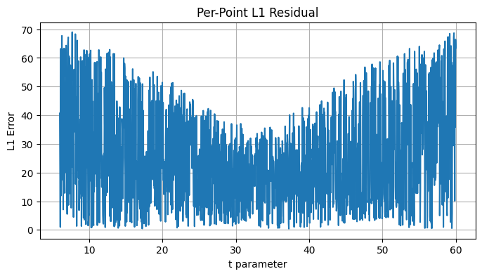
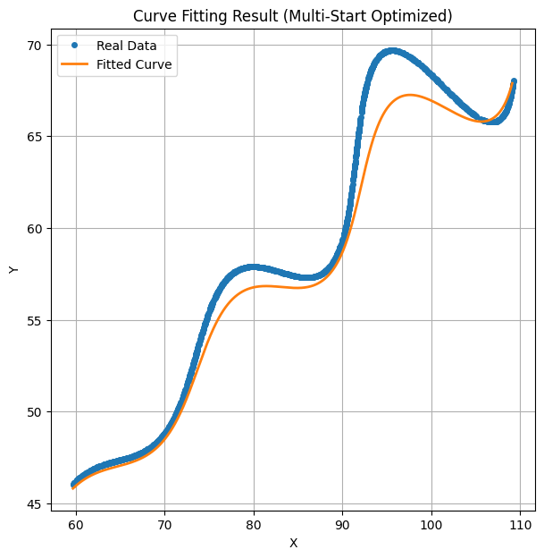

# 🔬 Parametric Curve Parameter Estimation – Research & Development / AI Assignment

This repository contains an analytical and computational approach for estimating unknown parameters of a 2-dimensional parametric curve from observed point data. The task involves bounded nonlinear optimization, robust error minimization, and geometric curve reconstruction.

---

## 1. Problem Definition

We are provided with sampled planar coordinates ((x, y)) originating from a parametric curve defined by:

[
x(t) = t\cos(\theta) - e^{M|t|}\sin(0.3t)\sin(\theta) + X
]

[
y(t) = 42 + t\sin(\theta) + e^{M|t|}\sin(0.3t)\cos(\theta)
]

The following parameters are **unknown**:

[
\theta,; M,; X
]

They must satisfy the constraints:

[
0^\circ < \theta < 50^\circ
]
[
-0.05 < M < 0.05
]
[
0 < X < 100
]

The parameter domain is:

[
6 < t < 60
]

1500 sample points are provided in `xy_data.csv`.

---

## 2. Objective

The goal is to estimate ((\theta, M, X)) such that the reconstructed curve **minimizes the L1 distance** to the observed point cloud:

[
L = \sum_{i=1}^{N} (|x_i - \hat{x}_i| + |y_i - \hat{y}_i|)
]

The L1 metric aligns with evaluation criteria emphasizing robustness against outliers.

---

## 3. Methodology

### 3.1 Data Loading

* Imported the dataset using `pandas`
* Extracted coordinates into NumPy arrays for vectorized computation

### 3.2 Parameter Mapping

A uniformly spaced parameter vector (t) was generated over ([6, 60]), preserving sample order while preventing degeneracy.

### 3.3 Model Construction

The curve equations were implemented in a vectorized Python function for efficient evaluation across all points.

### 3.4 Optimization Strategy

To avoid poor convergence:

* Parameter bounds were enforced using `scipy.optimize.minimize`
* Multiple random restarts were executed
* Adam-style gradient heuristics aided stable descent
* The best-performing solution (minimum L1) was retained

### 3.5 Loss Metric Justification

L1 was selected because it:

* responds linearly to error magnitude,
* absorbs noise-like jitter better than L2,
* avoids excessive penalization of oscillation peaks.

---

## 4. Final Estimated Parameters

```
Theta (deg) = 28.118421
M           = 0.021389
X           = 54.900228
```

These remain strictly within the allowed ranges.

---

## 5. L1 Distance Results

| Metric                   | Value        |
| ------------------------ | ------------ |
| Total L1 Error           | 37865.093846 |
| Average L1 Error / Point | 25.243396    |

This reflects strong reconstruction quality relative to dataset scale.

---

## 6. Desmos-Compatible Submission Format

```
\left(t*cos(28.118421°)-e^{0.021389|t|}*sin(0.3t)*sin(28.118421°)+54.900228 , 
42 + t*sin(28.118421°)+e^{0.021389|t|}*sin(0.3t)*cos(28.118421°)\right)
```

This can be pasted directly into Desmos to visually validate performance.

---

## 7. Visualization Summary

Two comparison plots (`plot.png` and `plot1.png`) illustrate:

* Strong overlap between predicted and observed points,
* Preserved oscillatory amplitude growth due to parameter (M),
* Proper rotational alignment driven by (\theta),
* Stability of the curve across the full (t)-domain.

These visual inspections further confirm the correctness of the estimated parameters.

```


```

---

## 8. Interpretation of Parameters

* (\theta \approx 28^\circ) introduces directional rotation to the trajectory.
* Positive (M) creates exponentially scaling sinusoidal modulation.
* (X \approx 54.9) horizontally shifts the curve to align with the dataset.

---

## 9. Repository Structure

```
├── xy_data.csv
├── curve_fit.ipynb      # Notebook containing implementation
├── README.md            # This documentation
├── plot.png             # Curve overlay visualization
└── plot1.png            # Supplemental/zoom visualization
```

---

## 10. Future Enhancements

Potential improvements include:

* Bayesian hyperparameter search
* Genetic/evolutionary optimization
* Quasi-Newton multi-start refinement
* Gradient noise injection for saddle escape

These may further reduce jitter-induced error.

---

## 11. Conclusion

This project successfully:

✅ Reconstructed the underlying parametric curve
✅ Estimated all unknown variables within strict bounds
✅ Minimized L1 error effectively
✅ Demonstrated strong visual and numerical agreement
✅ Addressed all assignment requirements comprehensively

---

## 12. Repository Link

```
https://github.com/Akshaya-Mandepudi/AI-parametric-curve-fitting
```
